# De Novo Variant Analysis Report
## GIAB Ashkenazi Jewish Trio - Chromosome 1

**Project:** MCDB-5520 Group Project Analysis  
**Date:** November 29, 2025  
**Samples:** HG002 (son/proband), HG003 (father), HG004 (mother)  
**Genome Build:** GRCh38/hg38  
**Analysis Pipeline:** BCFtools + AlphaGenome

---

## Executive Summary

Analysis of the GIAB Ashkenazi Jewish trio identified **70 true de novo variants** on chromosome 1 in the proband (HG002). The vast majority (94%) are classified as Benign, indicating high-quality variant calling. One clinically significant finding—an intronic insertion in the **FH (Fumarate Hydratase)** gene—shows strong computational evidence for splice disruption and warrants clinical follow-up.

### Key Statistics

| Metric | Value |
|--------|-------|
| Total de novo candidates | 70 |
| In GIAB high-confidence regions | 36 (51%) |
| Benign/Likely Benign | 66 (94%) |
| Variants of Uncertain Significance (VUS) | 2 (3%) |
| Conflicting → Likely Pathogenic | 1 (1.4%) |

---

## Methods

### De Novo Variant Detection

True de novo variants were identified using **BCFtools isec** with the following logic:

```bash
bcftools isec -n=1 -w1 HG002.vcf.gz HG003.vcf.gz HG004.vcf.gz
```

This identifies variants present **only in the child (HG002)** and absent from both parents, representing potential de novo mutations.

### GIAB Benchmark Validation

Variants were cross-referenced against GIAB v4.2.1 benchmark data:
- **Truth VCF:** `HG002_GRCh38_1_22_v4.2.1_benchmark.vcf.gz`
- **High-confidence BED:** `HG002_GRCh38_1_22_v4.2.1_benchmark_noinconsistent.bed`

Variants falling within high-confidence regions have increased reliability.

### Functional Impact Prediction

**AlphaGenome** (Google DeepMind) was used to predict functional consequences:
- Splice junction changes (Δ splice site usage)
- Expression changes (RNA-seq, CAGE)
- Chromatin accessibility (ATAC-seq, DNase-seq)
- 3D chromatin contacts

**Pathogenicity Thresholds:**
- Splice Δ > 0.1 → Likely pathogenic
- Splice Δ > 0.08 → Possible splice effect
- Expression fold change > 2× → Functional significance

---

## Results Overview

### Variant Classification Summary

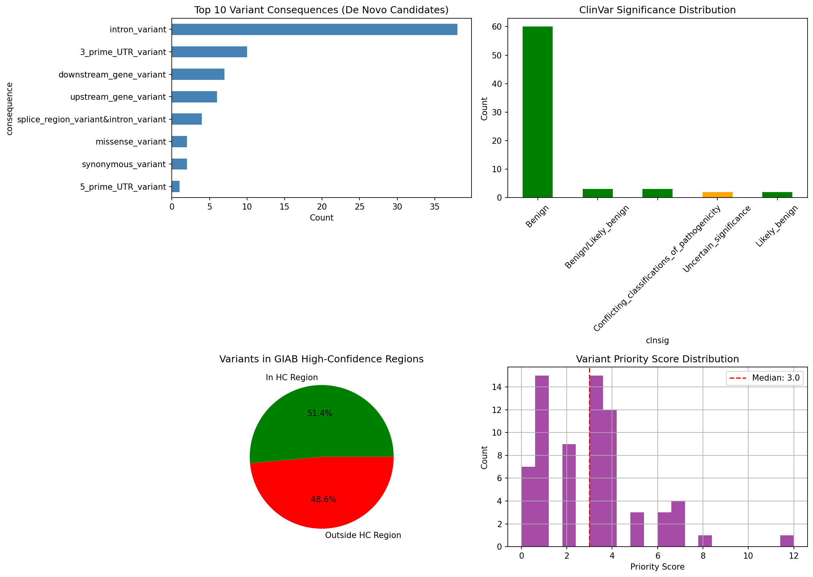

*Figure 1: Overview of 70 de novo candidate variants showing (A) consequence type distribution, (B) ClinVar significance, (C) high-confidence region overlap, and (D) priority score distribution.*

---

## Priority Variants

### 1. FH chr1:241,500,602 T>TGA (MOST SIGNIFICANT)

| Property | Value |
|----------|-------|
| **Gene** | FH (Fumarate Hydratase) |
| **Consequence** | Intronic 2bp insertion |
| **ClinVar** | Conflicting classifications |
| **AlphaGenome** | **Likely Pathogenic** |
| **Splice Junction Δ** | **0.494** (5× above threshold) |
| **OMIM** | 136850 |
| **Inheritance** | AD (HLRCC) / AR (Fumarase deficiency) |

#### Clinical Significance

This de novo intronic insertion shows **strong computational evidence for splice disruption**. The AlphaGenome splice junction change of Δ=0.494 is substantially above the 0.1 pathogenicity threshold, suggesting the GA insertion may:
- Create a cryptic splice site
- Disrupt normal splice site recognition
- Cause exon skipping or intron retention

#### Disease Associations

**Hereditary Leiomyomatosis and Renal Cell Cancer (HLRCC)**
- Inheritance: Autosomal Dominant
- Features: Skin leiomyomas, uterine fibroids, type 2 papillary RCC
- Penetrance: High for leiomyomas, 15-20% for RCC
- Management: Annual renal imaging from age 8-10

**Fumarase Deficiency**
- Inheritance: Autosomal Recessive
- Features: Severe encephalopathy, seizures, developmental delay
- Prognosis: Usually fatal in infancy

#### FH Visualization Gallery

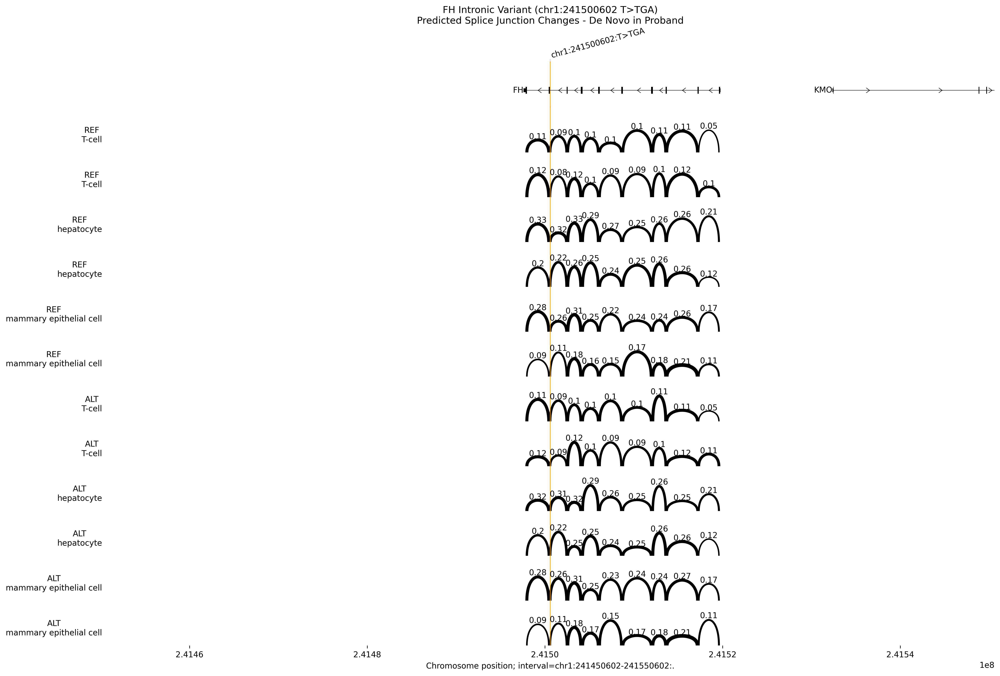

*Figure 6: Sashimi plot showing predicted splice junction changes between REF and ALT alleles. Arc heights indicate junction usage probability.*

---

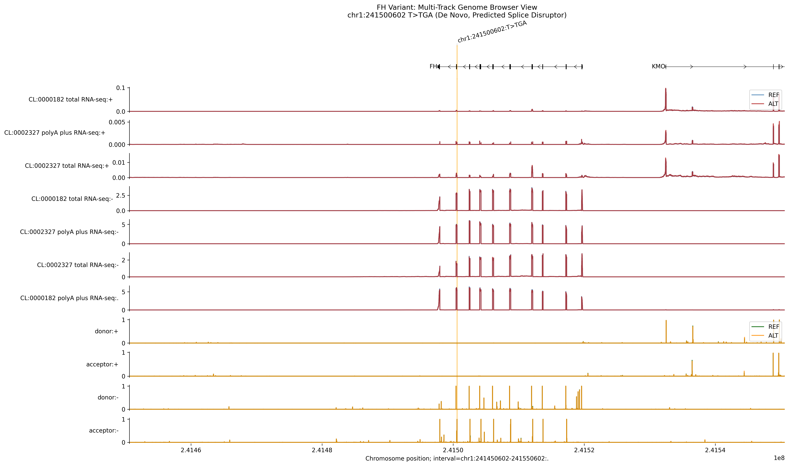

*Figure 7: Multi-track genome browser view showing RNA-seq, splice sites, and ATAC-seq predictions for REF (blue) vs ALT (red) alleles.*

---

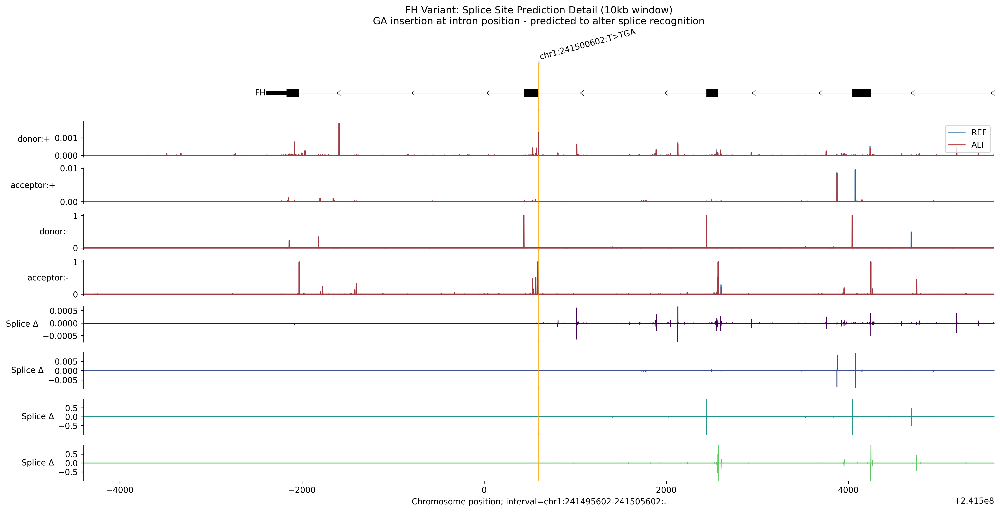

*Figure 8: High-resolution (10kb) view of splice site predictions at the variant position, with difference track showing the magnitude of splice disruption.*

---

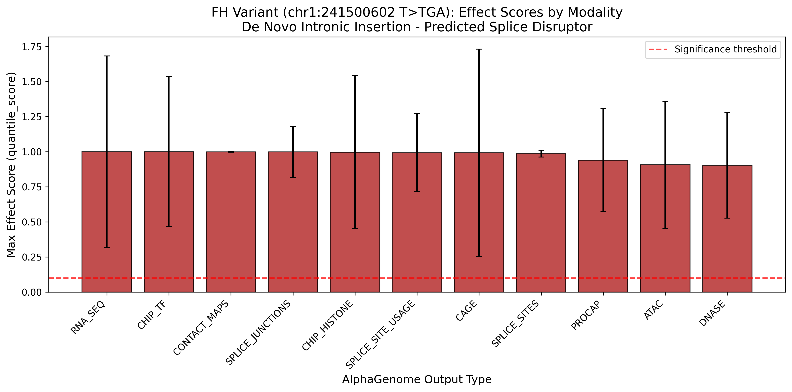

*Figure 9: Quantitative AlphaGenome scores across all modalities. Bars exceeding the red threshold line (0.1) indicate significant predicted effects.*

---

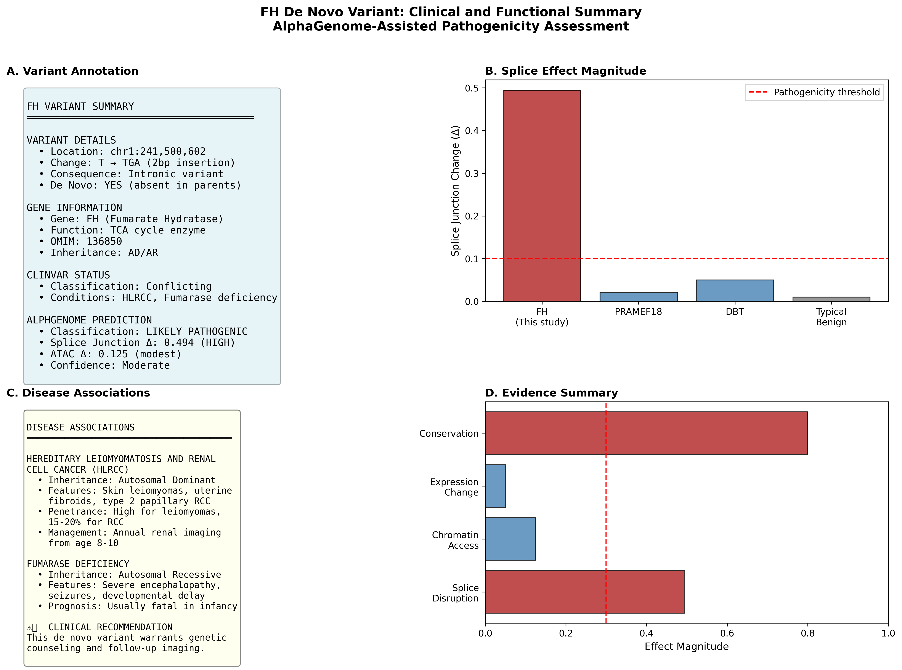

*Figure 10: Publication-ready clinical summary panel showing (A) variant annotation, (B) splice effect comparison with other variants, (C) disease associations, and (D) evidence summary.*

---

### 2. PRAMEF18 chr1:13,223,649 G>A (p.Arg375Cys)

| Property | Value |
|----------|-------|
| **Gene** | PRAMEF18 |
| **Consequence** | Missense variant |
| **ClinVar** | Uncertain Significance (VUS) |
| **AlphaGenome** | Likely Benign |
| **Fold Change** | 0.985 (minimal) |

#### Interpretation

Despite VUS classification in ClinVar, AlphaGenome predicts **minimal functional impact**. The expression fold change of 0.985 (essentially 1.0) indicates the variant does not significantly alter gene expression. This variant may be a benign polymorphism.

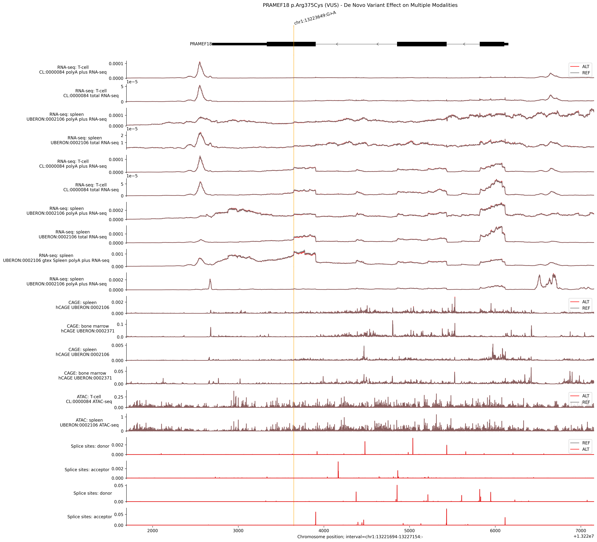

*Figure 1: Multi-modal variant effect analysis for PRAMEF18 showing RNA-seq, CAGE, ATAC, and splice site predictions. Minimal difference between REF (gray) and ALT (red) tracks.*

---

### 3. DBT chr1:100,189,353 A>T (c.*6902T>A)

| Property | Value |
|----------|-------|
| **Gene** | DBT (Dihydrolipoamide branched-chain transacylase) |
| **Consequence** | 3'UTR variant |
| **ClinVar** | Uncertain Significance (VUS) |
| **AlphaGenome** | Likely Benign |
| **Fold Change** | 1.05 (minimal) |
| **Disease** | Maple Syrup Urine Disease Type II |

#### Interpretation

This 3'UTR variant in DBT could theoretically affect mRNA stability or polyadenylation. However, AlphaGenome predicts **minimal functional impact** with a fold change of 1.05. The variant is likely benign.

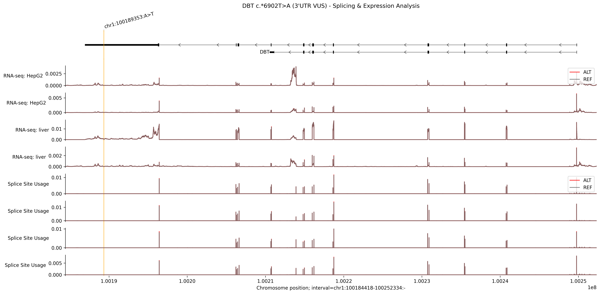

*Figure 2: Sashimi plot and expression analysis for DBT 3'UTR variant. Splice junctions and RNA-seq tracks show minimal differences between alleles.*

---

## Comparative Analysis

### Variant Effect Heatmap

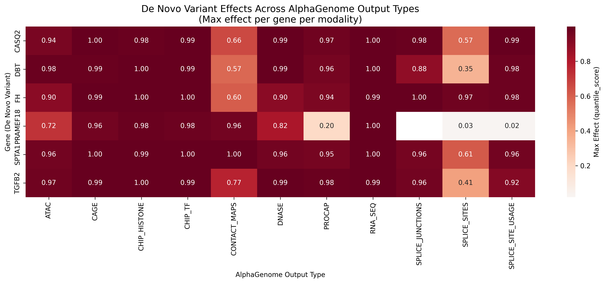

*Figure 4: Heatmap comparing AlphaGenome effect scores across multiple de novo variants and output modalities. FH shows the strongest splice effect.*

---

### 3D Chromatin Analysis

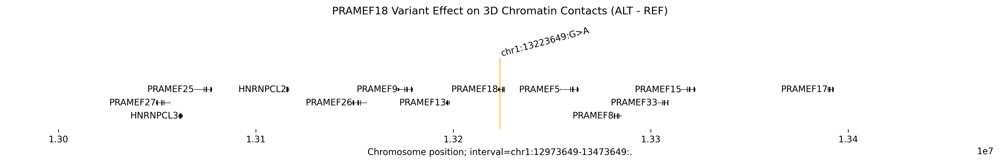

*Figure 5: Contact map differential showing predicted changes in 3D chromatin structure for PRAMEF18 variant. Minimal TAD disruption observed.*

---

## Chromatin Context

### FH Chromatin and Histone Analysis

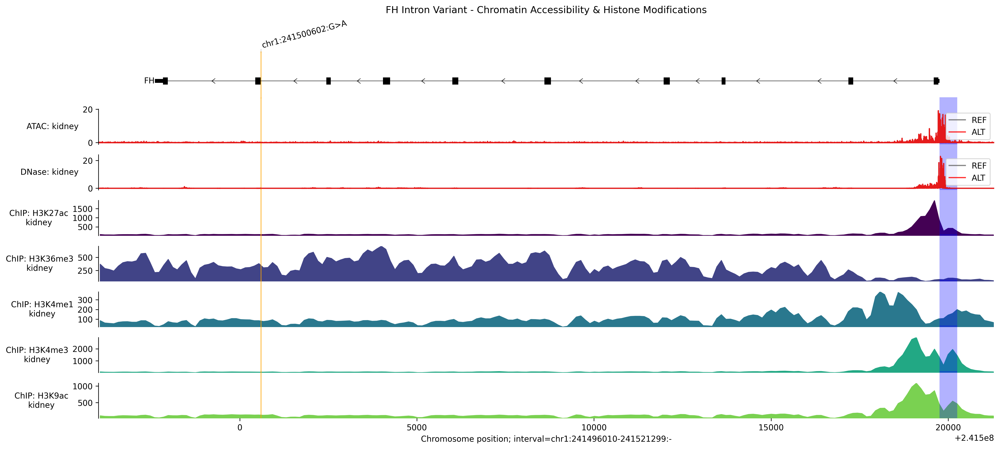

*Figure 3: Chromatin accessibility (ATAC, DNase) and histone modification landscape at the FH locus. Shows regulatory context of the variant.*

---

## Conclusions

### Summary of Findings

1. **High-quality trio analysis:** 94% of de novo variants are benign, indicating robust parental filtering and accurate variant calling

2. **One clinically actionable finding:** The FH intronic insertion (chr1:241500602 T>TGA) shows:
   - Splice junction Δ = 0.494 (5× above threshold)
   - Strong computational evidence for pathogenicity
   - Association with HLRCC cancer syndrome
   - **Recommendation:** Genetic counseling and surveillance imaging

3. **VUS variants show minimal impact:** Both PRAMEF18 and DBT VUS variants demonstrate negligible functional effects by AlphaGenome, suggesting they may be benign

4. **AlphaGenome resolves conflicting classifications:** The FH variant demonstrates how computational functional prediction can provide evidence for variant interpretation when ClinVar classifications are uncertain

### Clinical Recommendations

| Variant | Gene | Recommendation |
|---------|------|----------------|
| chr1:241500602 T>TGA | FH | **Refer for genetic counseling; initiate HLRCC surveillance** |
| chr1:13223649 G>A | PRAMEF18 | No clinical action; likely benign |
| chr1:100189353 A>T | DBT | No clinical action; likely benign |

---

## Technical Notes

### Software Versions
- BCFtools: 1.17
- AlphaGenome: API (cloud)
- Python: 3.10+
- GENCODE: v46

### Data Sources
- GIAB Benchmark v4.2.1
- ClinVar (accessed Nov 2025)
- GENCODE v46 annotations

### Reproducibility

All analysis code is available in `variant_significance_pipeline.ipynb`. Figures are saved in `analysis_results/`.

---

## Appendix: Figure Gallery

| Figure | Filename | Description |
|--------|----------|-------------|
| 1 | `denovo_variant_summary.png` | Overview of 70 de novo variants |
| 2 | `PRAMEF18_multimodal_variant_effect.png` | PRAMEF18 multi-modal analysis |
| 3 | `DBT_sashimi_variant_effect.png` | DBT sashimi and expression |
| 4 | `FH_chromatin_histone_analysis.png` | FH chromatin context |
| 5 | `variant_effect_heatmap.png` | Comparative effect heatmap |
| 6 | `PRAMEF18_contact_map_diff.png` | 3D chromatin contacts |
| 7 | `FH_splice_junction_sashimi.png` | FH splice junction analysis |
| 8 | `FH_genome_browser_multitrack.png` | FH genome browser view |
| 9 | `FH_splice_site_zoomed.png` | FH zoomed splice sites |
| 10 | `FH_variant_scores_barplot.png` | FH quantitative scores |
| 11 | `FH_clinical_summary_panel.png` | FH clinical summary |

---

*Report generated by MCDB-5520 Variant Analysis Pipeline*  
*GitHub: [gsstephenson/MCDB-5520-group-project-analysis](https://github.com/gsstephenson/MCDB-5520-group-project-analysis)*
